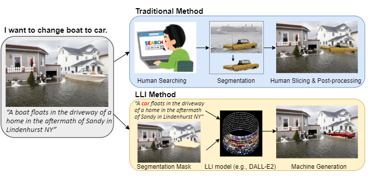
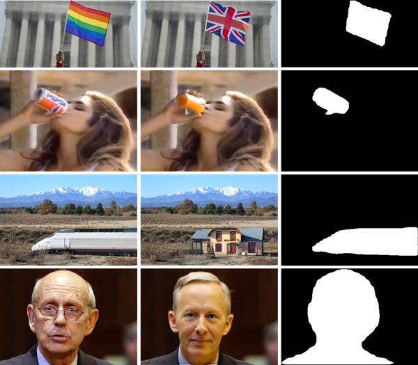

# AutoSplice: A Text-prompt Manipulated Image Dataset for Media Forensics

The AutoSplice dataset was proposed in the CVPR Workshop on Media Forensics paper "AutoSplice: A Text-prompt Manipulated Image Dataset for Media Forensics", which leverages the DALL-E2 language-image model to automatically generate and splice
masked regions guided by a text prompt. It consists of 5,894 manipulated and authentic images. 



## Summary 
The database contains 3, 621 images by locally or globally manipulating real-world image-caption pairs, and 2, 273 authentic images.

Three JPEG compression versions are included, JPEG-100, JPEG-90, and JPEG-75, along with their manipulation masks.




## Dataset Download
If you would like to access the *AutoSplice* dataset, please fill out this [google form](https://docs.google.com/forms/d/1bHbWZ-DsG1-VKaMs4Puy0996yj485x7HK13fgbNRerE/edit). The download link will be sent to you once the form is accepted (in 72 hours). If you have any questions, please send email to [autosplice.dataset@gmail.com].

## License and Citation
The AutoSplice dataset is released only for academic research. Researchers from educational institute are allowed to use this database freely for noncommercial purpose.

If you use this dataset, please cite the following paper:
```
@inproceedings{jia2023autosplice,
  title={AutoSplice: A Text-prompt Manipulated Image Dataset for Media Forensics},
  author={Jia, Shan and Huang, Mingzhen and Zhou, Zhou and Ju, Yan and Cai, Jialing and Lyu, Siwei},
  booktitle={Proceedings of the IEEE/CVF Conference on Computer Vision and Pattern Recognition},
  pages={893--903},
  year={2023}
}
